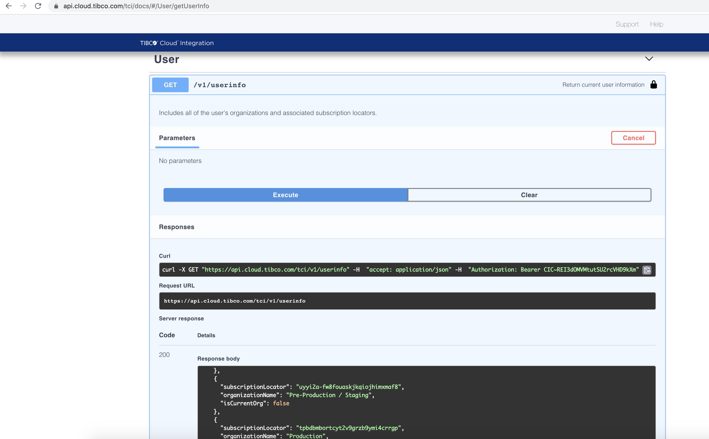
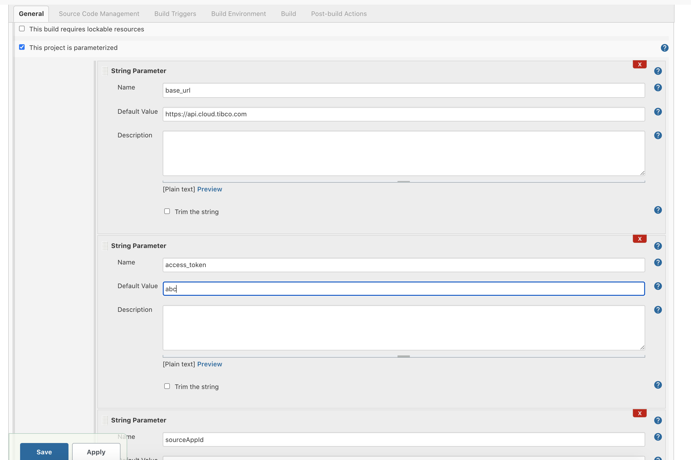
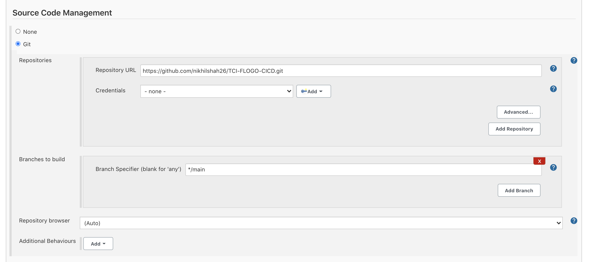
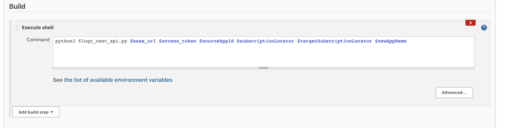
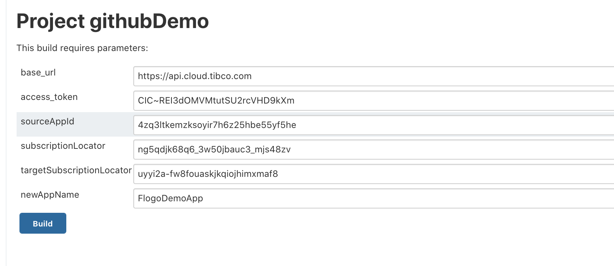
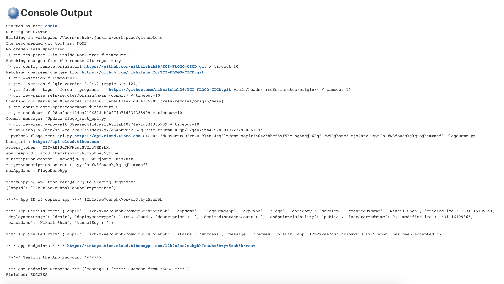
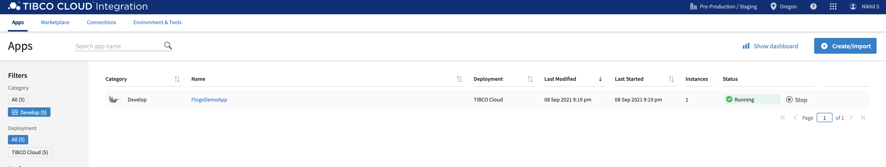

# CI/CD workflow for deploying/copying/testing FLOGO applications in TIBCO Cloud Integration using TIBCO Cloud™ Integration API and Jenkins


## Description

This sample demonstrates a simple workflow mentioned below about how to deploy FLOGO apps to TCI, copy them from one org to another, run the app, and test the endpoints.

1. Checkout Flogo app json and manifest json from GitHub
2. Deploy the app to Dev/QA Org using TIBCO Cloud™ Integration API
3. Test the app endpoint
4. Copy the app to Staging Org
5. Override the App Property in Staging Org
6. Test the Endpoint
7. Delete the app from Dev/QA Org

## Prerequisites

* Generate OAuth2 access token for Integration Domain from [TIBCO Cloud Settings](https://account.cloud.tibco.com/manage/settings/oAuthTokens) page
* Install Jenkins - https://www.jenkins.io/doc/book/installing/
* Install python3 on the host system where jenkins is running
* Install python requests module using - ```pip install requests```

## Running the python script stand-alone

In order to do unit testing before creating the CI/CD pipeline, it is recommended to run the python script stand alone to make sure, it is working as per the workflow. Run the below command from the terminal.

```
python3 flogo_rest_api.py <api_url> <access_token> <sourceAppId> <subscriptionLocator> <targetSubscriptionLocator> <newAppName> <endpoint_path> <app_artifacts_github_path> <override_app_prop_json>
```

where -
* **api_url** : The url of API as per region of your TIBCO Cloud™ Account subscription. For eg, for US region, it is ```https://api.cloud.tibco.com/tci/v1``` . Refer [this](https://integration.cloud.tibco.com/docs/#Subsystems/tci-api/home.html?TocPath=TIBCO%2520Cloud%25E2%2584%25A2%2520Integration%2520API%257C_____0) doc for more info.
* **access_token** : The OAuth2 Bearer access token to be generated as mentioned in Prerequisites section
* **sourceAppId** : (Optional) Only required if you already have an app in the org and need to copy it to another org. Pass 0 as the value if this is not applicable.
* **subscriptionLocator** : Locator of the subscription. Enter 0 for the subscription associated with your OAuth token. You can get the subscriptionLocator for your Org using this API ```https://api.cloud.tibco.com/tci/v1/userinfo```
* **targetSubscriptionLocator** : Subscription locator of the target organization. Enter 0 for the subscription associated with your OAuth token. You can get the subscriptionLocator for your target Org using this API ```https://api.cloud.tibco.com/tci/v1/userinfo```
* **newAppName** : New app name. Name must be unique in the target organization.
* **endpoint_path** : Endpoints are applicable for app which has ReceiveHTTPMessage/REST Trigger. Endpoint path is the value of path field in ReceiveHTTPMessage/REST Trigger. For eg ```/rest```
* **app_artifacts_github_path**  Raw file path on github where your app flogo.json and manifest.json are located. For eg ```https://raw.githubusercontent.com/nikhilshah26/TCI-FLOGO-CICD/main/Flogo_App```
* **override_app_prop_json** JSON for Application Properties/Variables, Engine Variables to be updated. Description and data type are ignored for engine and app variables.
For eg: ```[{"description":"string","name":"Message","type":"string","value":"*****This\u0020message\u0020is\u0020overridden******"}]```
Note that you can pass multiple app props as array to the json.
If the app prop value contains special characters like space, you will need to encode it unicode format. For eg: For space, you need to specify \u0020 .
If you do not want to override any app prop, then pass {}.


## Running as CI/CD pipeline using jenkins

1. Get the subscriptionLocator of the source org and target org from the ```userinfo``` TIBCO Cloud™ Integration API as shown below -


2. Start the jenkins and login to jenkins url - http://localhost:8080/

3. Create a freestyle project

4. Select the project and click on Configure. Check This project is parameterized
Add the params as api_url, access_token, sourceAppId, subscriptionLocator, targetSubscriptionLocator, newAppName, endpoint_path, app_artifacts_github_path, override_app_prop_json and their default values


5. Select SCM as git and configure using the repo url as shown below -


6. Add build step as shown below -


7. Click on Save and click on Build with Parameters as below -


8. Check the console output as below and see that the app is copied from Dev/QA org to Staging Org and also the app is running and the endpoints are being tested.


9. Check the app is copied to and running in TCI in Pre-Production/Staging Org -



